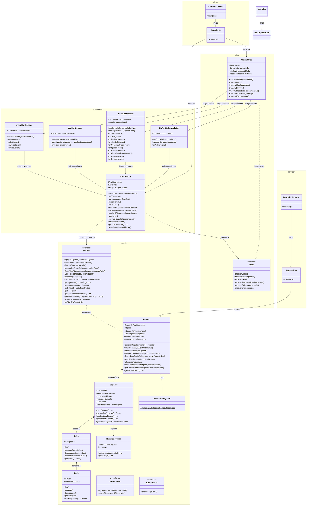

```mermaid
classDiagram
    direction TB

    namespace modelo {
        class IPartida {
            <<interface>>
            +agregarJugador(nombre) Jugador
            +iniciarPartida(idJugadorSolicitud)
            +tirarLosDados(idJugador)
            +bloqueoDeDados(idJugador, indiceDado)
            +RaiseTrasTirada(idJugador, nuevaApuestaTotal)
            +Call_Fold(idJugador, quiereIgualar)
            +plantarse(idJugador)
            +solucionEmpate(idJugador, quiereRepartir)
            +getJugadores() List~Jugador~
            +getJugadorActual() Jugador
            +getEstado() EstadoDePartida
            +getPozo() int
            +getApuestaMaximaActual() int
            +getDadosVisibles(idJugadorConsulta) Dado[]
            +isDadosRevelados() boolean
            +getTirosEnTurno() int
        }

        class Partida {
            -EstadoDePartida estado
            -int pozo
            -int apuestaMaximaActual
            -List~Jugador~ jugadores
            -Jugador jugadorActual
            -boolean dadosRevelados
            +agregarJugador(nombre) Jugador
            +iniciarPartida(idJugadorSolicitud)
            +tirarLosDados(idJugador)
            +bloqueoDeDados(idJugador, indiceDado)
            +RaiseTrasTirada(idJugador, nuevaApuestaTotal)
            +Call_Fold(idJugador, quiereIgualar)
            +plantarse(idJugador)
            +solucionEmpate(idJugador, quiereRepartir)
            +getDadosVisibles(idJugadorConsulta) Dado[]
            +getTirosEnTurno() int
        }

        class Jugador {
            -int idJugador
            -String nombreJugador
            -int cantidadFichas
            -int aporteEnVuelta
            -Cubo cubo
            -ResultadoTirada ultimaJugada
            +getIdJugador() int
            +getnombreJugador() String
            +getCantidadFichas() int
            +getAporteEnVuelta() int
            +getUltimaJugada() ResultadoTirada
        }

        class Cubo {
            -Dado[] dados
            +tirar()
            +bloquearDado(indice)
            +desbloquearDado(indice)
            +desbloquearTodosDados()
            +getDados() Dado[]
        }

        class Dado {
            -int valor
            -boolean bloqueado
            +tirar()
            +bloquear()
            +desbloquear()
            +getValor() int
            +estaBloqueado() boolean
        }

        class EvaluadorJugadas {
            +evaluar(Dado[] dados)$ ResultadoTirada
        }

        class ResultadoTirada {
            -String nombreJugada
            -int puntaje
            +getNombreJugada() String
            +getPuntaje() int
        }

        class IObservable {
            <<interface>>
            +agregarObservador(IObservador)
            +quitarObservador(IObservador)
        }

        class IObservador {
            <<interface>>
            +actualizar(evento)
        }
    }

    namespace controlador {
        class Controlador {
            -IPartida modelo
            -IVista vista
            -Integer idJugadorLocal
            +setModeloRemoto(modeloRemoto)
            +setVista(vista)
            +agregarJugador(nombre)
            +iniciarPartida()
            +tirarDados()
            +alternarBloqueoDado(indiceDado)
            +subirApuesta(nuevaApuestaTotal)
            +igualarOAbandonar(quiereIgualar)
            +plantarse()
            +resolverEmpate(quiereRepartir)
            +abandonarPartida()
            +getTirosEnTurno() int
            +actualizar(observable, arg)
        }

        class menuControlador {
            -Controlador controladorMvc
            +setControlador(controladorMvc)
            +onJugar(event)
            +onSalir(event)
            +onUnirse(event)
            +onAtras(event)
        }

        class salaControlador {
            -Controlador controladorMvc
            +setControlador(controladorMvc)
            +actualizarSala(jugadores, nombreJugadorLocal)
            +onIniciarPartida(event)
        }

        class mesaControlador {
            -Controlador controladorMvc
            -Jugador jugadorLocal
            +setControlador(controladorMvc)
            +setJugadorLocal(jugadorLocal)
            +actualizarMesa(...)
            +onTirar(event)
            +onDado0..4(event)
            +onAbrirSubir(event)
            +onConfirmarSubir(event)
            +onIgualar(event)
            +onRetirarse(event)
            +onAbandonarPartida(event)
            +onRepartir(event)
            +onRejugar(event)
        }

        class finPartidaControlador {
            -Controlador controlador
            +setControlador(controlador)
            +mostrarGanador(jugadores)
            +onVolverMenu()
        }
    }

    namespace vista {
        class IVista {
            <<interface>>
            +mostrarMenu()
            +mostrarSala(jugadores)
            +mostrarMesa(...)
            +mostrarResultadoRonda(mensaje)
            +mostrarFinPartida(mensaje)
            +mostrarError(mensaje)
        }

        class VistaGrafica {
            -Stage stage
            -Controlador controlador
            -salaControlador ctrlSala
            -mesaControlador ctrlMesa
            +setControlador(controlador)
            +mostrarMenu()
            +mostrarSala(jugadores)
            +mostrarMesa(...)
            +mostrarResultadoRonda(mensaje)
            +mostrarFinPartida(mensaje)
            +mostrarError(mensaje)
        }
    }

    namespace servidor {
        class AppServidor {
            +main(args)
        }
        class LanzadorServidor {
            +main(args)
        }
    }

    namespace cliente {
        class AppCliente {
            +main(args)
        }
        class LanzadorCliente {
            +main(args)
        }
    }

    Launcher --> HelloApplication : lanza
    IPartida <|.. Partida : implements
    Partida *-- Jugador : contiene 1..N
    Jugador *-- Cubo : posee 1
    Cubo *-- Dado : contiene 5
    Jugador --> ResultadoTirada : registra
    Partida ..> EvaluadorJugadas : usa
    Controlador --> IPartida : invoca stub remoto
    Controlador --> IVista : actualiza
    VistaGrafica ..|> IVista : implements
    VistaGrafica --> menuControlador : carga / enlaza
    VistaGrafica --> salaControlador : carga / enlaza
    VistaGrafica --> mesaControlador : carga / enlaza
    VistaGrafica --> finPartidaControlador : carga / enlaza
    menuControlador --> Controlador : delega acciones
    salaControlador --> Controlador : delega acciones
    mesaControlador --> Controlador : delega acciones
    finPartidaControlador --> Controlador : delega acciones
    AppServidor --> Partida : publica
    LanzadorServidor --> AppServidor : inicia
    AppCliente --> Controlador : conecta
    AppCliente --> VistaGrafica : inicia FX
    LanzadorCliente --> AppCliente : inicia
```
